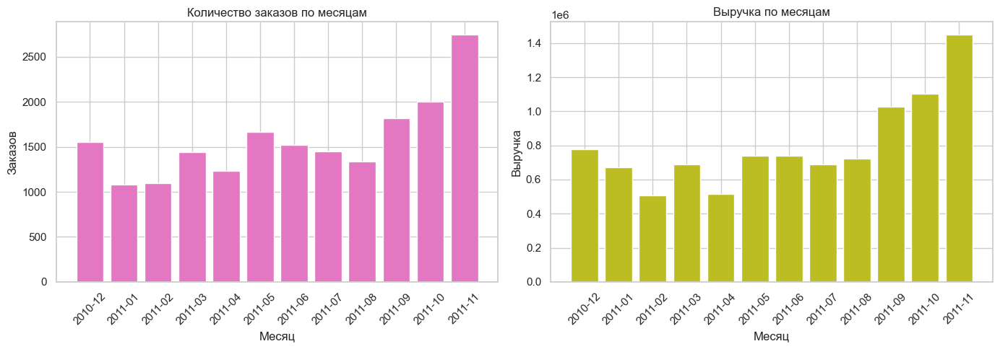
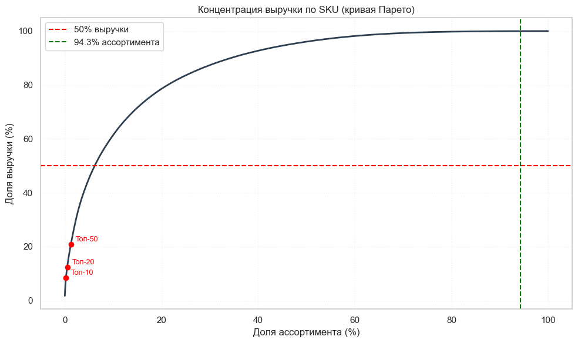
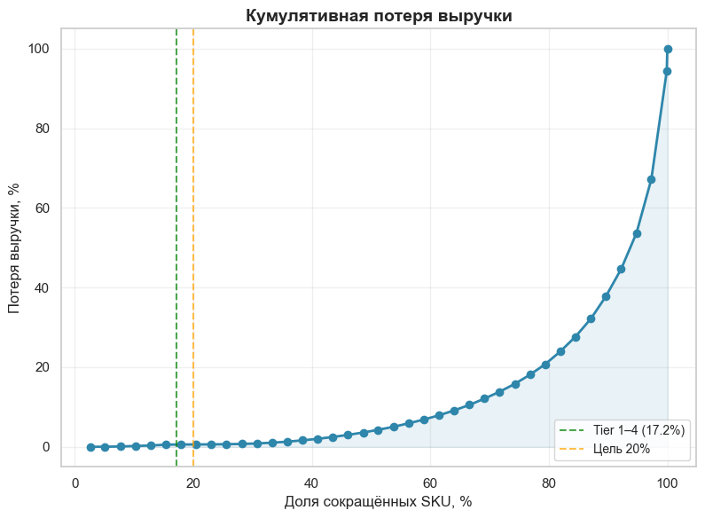

# Проект: ABC/XYZ-анализ ассортимента интернет-магазина (Online Retail II)

**Описание:** Анализ ассортимента британского интернет-магазина подарков и товаров для дома на транзакционных данных Online Retail II (**3 905 SKU**, период декабрь 2010 – ноябрь 2011): ABC/XYZ-сегментация, проверка рисков сокращения (связь с ключевыми товарами, сезонность, опт, рост спроса, возвраты), RFM-анализ клиентов и адаптированная BCG-матрица. [Проект выполнен в Jupyter Notebook](assortment_optimization_abc_xyz_online_retail.ipynb).

---

## Ситуация

Интернет-магазин постепенно расширял ассортимент, и руководство подозревает, что часть позиций продаётся редко, занимает место на складе и усложняет закупки. Компания рассматривает сокращение примерно на **20% ассортимента** (около 781 SKU), но простое удаление «слабых» товаров рискованно: можно потерять выручку, ухудшить клиентский опыт или убрать важные дополнения к основным покупкам.

В распоряжении — датасет Online Retail II (UCI, Kaggle): **1 067 371** строка заказов за декабрь 2009 – декабрь 2011. Особенности данных:

* отмены (1,83% строк) и отрицательные количества без признака отмены (складские корректировки `lost`, `damaged`, `short`);
* **22,77%** строк без `Customer ID`, 0,41% без `Description`;
* **34 335** полных дубликатов (3,22%), нулевые цены, служебные `StockCode` (почтовые расходы, комиссии, скидки, подарочные ваучеры, тестовые записи);
* декабрь 2011 в данных неполный (последняя дата — 9 декабря).

## Задача

* Выделить 12 полных последовательных месяцев и подготовить данные: описать и обосновать правила очистки.
* Описать бизнес в выбранном периоде и оценить концентрацию выручки по SKU.
* Провести ABC-анализ (по выручке) и XYZ-анализ (по вариативности месячного спроса), объединить их в матрицу из 9 ячеек.
* Сформулировать стратегию управления запасами по группам: что держать постоянно, а что — с осторожным запасом.
* Разработать собственные критерии кандидатов на сокращение, проверить связанные с ним риски и сопоставить долю сокращаемых SKU с долей связанной с ними выручки.

## Действия

### Этап 1. Выбор периода и очистка данных
* Выбран период **декабрь 2010 – ноябрь 2011**: он включает предрождественский пик и летний спад, не содержит неполного декабря 2011 и даёт самый свежий срез ассортимента.
* Удалены полные дубликаты, отмены (`Invoice` начинается с `C`), строки с `Quantity` ≤ 0 и `Price` ≤ 0, служебные `StockCode`. Код `PADS` оставлен как реальный товар.
* Пропуски в `Description` восстановлены самым частым описанием по `StockCode`. Пропуски в `Customer ID` оставлены: для ABC/XYZ он не нужен, а удаление этих строк убрало бы четверть выручки.
* Проверена связь отрицательных операций с исходными покупками (парная покупка найдена лишь у 28,6%), SKU с несколькими описаниями (23,2%), выбросы по `Quantity` и `Price` (перцентили, 1,5×IQR).
* Крупные заказы сохранены как реальный опт и помечены флагом `is_bulk_order` (`Quantity` > 100), SKU с аномальным разбросом цены — флагом `price_var_flag`.
* После очистки: **497 787** строк, **3 905** SKU, **4 293** покупателя.

### Этап 2. Базовая картина бизнеса
* Метрики периода: SKU, заказы, покупатели, проданные единицы, выручка, средний чек (на уровне заказа, а не строки).
* Динамика заказов и выручки по месяцам, концентрация выручки (топ-10/20/50 SKU, доля «длинного хвоста»).

### Этап 3. ABC-анализ
* Выручка агрегирована по `StockCode`, рассчитаны доля и накопительная доля. Проверены классические границы **80/15/5** — они хорошо легли на данные, поэтому оставлены.

### Этап 4. XYZ-анализ
* Для каждого SKU построен полный 12-месячный ряд с нулями в месяцах без продаж, рассчитан CV = std / mean. Пороги: X — CV ≤ 0,5, Y — до 1,0, Z — выше.
* Z-группа разобрана на причины высокого CV: поздно появившиеся товары (`newcomer`), очень низкий объём (`rare`), 1–2 месяца продаж (`sporadic`), сезонность (`seasonal`) и «настоящий» хаос (`chaotic_real`).
* XYZ пересчитан отдельно на розничных строках (без `is_bulk_order`), чтобы оценить влияние опта на вариативность.

### Этап 5. Матрица ABC/XYZ
* Результаты объединены по `StockCode`; для каждой из 9 ячеек рассчитаны SKU, выручка и её доля, единицы, заказы, покупатели, активные месяцы, средняя цена.

### Этап 6. Стратегия управления запасами
* Проверена сезонность товаров группы AZ (эвристика: 70% продаж в двух соседних месяцах), для всей Z-группы выполнена подклассификация по ABC-ячейкам.
* Проверено, сколько «хаотичных» товаров становятся стабильными после исключения оптовых заказов.
* Для каждой группы сформулировано правило: автозаказ, карантин для новинок, плановая закупка перед сезоном, ручной прогноз, заказ под запрос.

### Этап 7. Кандидаты на сокращение
* Сформирован стартовый пул из 4 тиров — от нулевого риска к повышенному: спорадический спрос, редкий спрос при полной истории, нижняя половина CZ-хаотичных по выручке, нижние 15% CY по выручке.
* Построена «кривая безопасности сокращения»: сколько выручки теряется при выводе 10%, 20%, 30% SKU.
* Проверены дополнительные риски: `Connection_Risk` (доля заказов кандидата, содержащих A-товар), `Unique_Customer_Risk` (клиенты, покупающие только этот SKU), `Growth_Signal` (рост продаж за последние 3 месяца относительно первых 3).
* Рассчитан `Burden Score` — прокси операционной нагрузки SKU (заказы, единицы, месяцы на полке при низкой выручке).
* Поиск «мёртвых» позиций вне пула: статусы `Dead`, `Dormant`, `Low-activity` с теми же проверками рисков. 

### Этап 8. RFM-анализ
* Клиенты сегментированы по давности, частоте и сумме покупок (тертили 1–3): Champions, Loyal, At Risk, Lost, Regular, New.
* Список кандидатов пересечён с сегментами: SKU считается рискованным, если больше 50% его выручки приходится на Champions и Loyal.

### Этап 9. Адаптированная BCG-матрица
* Реальной рыночной доли в данных нет, поэтому использованы внутренние показатели: рост выручки 2011 к 2010 и относительная доля (выручка SKU / выручка лидера). В матрицу допущены только не новые SKU с историей от 18 месяцев.
* Квадранты Stars, Cash Cows, Question Marks и Dogs пересечены с RFM-риском.

### Этап 10. Оценка эффекта и возвраты
* Итоговый список кандидатов сопоставлен со всем ассортиментом: доля SKU против доли исторической выручки.
* Возвраты, удалённые при очистке, посчитаны отдельно для кандидатов, в том числе «хвостовые» возвраты по продажам до декабря 2010.

## Результат

**Структура бизнеса.** За период — **18 957** заказов, **4 293** покупателя, **9 632 728 £** выручки, средний чек на заказ — **508,14 £**. Выручка заметно сезонна: рост начинается в сентябре, а ноябрь — пик периода (**2 751** заказ и около **1,45 млн £**).

*Сезонный подъём к концу года объясняет, почему часть товаров формально попадает в Z-группу: товар, который продаётся в основном в 1–2 соседних месяцах, получает CV > 1, хотя его спрос предсказуем.*

**Концентрация выручки.** Топ-10 SKU дают всего **8,5%** выручки, топ-50 — **20,9%**: зависимости от нескольких товаров нет. При этом около **5,7%** SKU формируют **48,1%** выручки, а **94,3%** SKU по отдельности приносят менее 0,1% каждый, но вместе дают **51,9%**. Массовое сокращение «всего мелкого» — рискованная идея.

**ABC и XYZ.**

| Группа | SKU | Доля ассортимента | Доля выручки |
|--------|-----|-------------------|--------------|
| A | 832 | 21,3% | 80,0% |
| B | 978 | 25,0% | 15,0% |
| C | 2 095 | 53,6% | 5,0% |

По вариативности спроса: X — **322** SKU (8,2%), Y — **1 062** (27,2%), Z — **2 521** (64,6%).

**Z — не значит «непредсказуемый спрос».** Подклассификация Z-группы показала разные причины высокого CV: **1 025** новинок с короткой историей, **894** действительно хаотичных SKU, **252** сезонных, **189** с редким спросом и **161** спорадический. Оптовые заказы искажают картину: при исключении опта группу меняют **276** SKU, а среди 894 хаотичных **115** оказываются на самом деле стабильными (93 → Y, 22 → X).

**Матрица ABC/XYZ.**

| Ячейка | SKU | Доля выручки | Комментарий |
|--------|-----|--------------|-------------|
| AX | 208 | 23,9% | продаются все 12 месяцев, автозаказ, запас 0,5–1 мес. |
| AY | 327 | 33,4% | самая «жирная» ячейка, автозаказ с сезонным коэффициентом |
| AZ | 297 | 22,7% | главный риск: высокая ценность при нестабильном спросе (в среднем 8 активных месяцев) |
| BX / BY / BZ | 97 / 361 / 520 | 1,6% / 5,6% / 7,8% | средний слой, правила зависят от причины нестабильности |
| CX / CY / CZ | 17 / 374 / 1 704 | 0,09% / 1,5% / 3,4% | CZ — 43,6% ассортимента при 3,4% выручки |

AX, AY и AZ вместе дают около 80% выручки. Внутри AZ 163 SKU — новинки (их нужно оставить на год и пересчитать), и только 113 — «настоящий» хаос, из которых 38 вызваны оптом. На ручном прогнозе остаётся около 75 SKU (около 6,7% выручки).

**Управленческие режимы** (3 905 SKU):

* автопилот (AX, AY, BX, BY, CX, CY): **1 384** SKU, около 66% выручки;
* ручной контроль (хаотичные без влияния опта): **779** SKU, около 11%;
* карантин (новинки): **1 025** SKU, около 16%;
* плановая закупка (сезонные): **252** SKU, около 2,3%;
* реклассификация (опт-чувствительные): **115** SKU, около 4,2%;
* под запрос (редкие): **189** SKU, около 0,2%;
* кандидаты на вывод (спорадические): **161** SKU, около 0,15%.

**Сколько можно сократить.** Если ранжировать только по выручке, сокращение 20% SKU кажется почти бесплатным: стартовый пул из **646** кандидатов (16,5% ассортимента) связан с **57 805 £** (**0,60%**) выручки, а 20% SKU стоят около 0,61%. Но выручка — не единственный критерий.

*Кривая построена только по выручке и не учитывает связи между товарами: именно поэтому на ней сокращение 20% выглядит безопасным, а риск-фильтры ниже показывают обратное.*

После проверки рисков картина меняется:

* **643 из 646** кандидатов (99,5%) регулярно встречаются в заказах вместе с A-товарами, а у **147** (22,8%) есть рост спроса за последние 3 месяца. Среди 3 259 SKU вне пула «чистыми» оказались лишь 14;
* **439 из 646** кандидатов (68%) покупают преимущественно Champions и Loyal. Без RFM-риска остаётся 213 SKU (207 из пула в 646 и 6 из 13 «мёртвых без рисков»);
* в BCG-матрице квадрант Dogs — 625 SKU и около 4,3% выручки 2011 года, но 592 из них (95%) покупают в основном Champions и Loyal. Без RFM-риска только **33** SKU;
* исключены из кандидатов новинки (1 025), сезонные (252), опт-чувствительные (115) и товары с растущим спросом.

**Итог: безопасно сократить удаётся лишь 16 SKU.** Это **0,41%** ассортимента и **998 £** исторической выручки (**0,0104%**). Возвраты показали: у 8 из 16 SKU возвратов больше продаж периода (это возвраты по продажам до декабря 2010), у 3 SKU высокая доля возвратов, но на незначительные суммы (максимум 42,50 £). Историческая выручка — не прогноз потерь: перед выводом эти 16 SKU требуют финальной бизнес-проверки, а RFM показал, что часть из них покупают ключевые клиенты.

**Вывод для бизнеса.** Данные не подтверждают возможность безопасно сократить 20% ассортимента, и искусственно дотягивать список до 781 SKU не стоит. Вместо этого предложена схема: автопилот для стабильных групп, карантин для новинок, плановая закупка для сезонных, ручной контроль для небольшого ядра нестабильных товаров и поэтапный вывод с A/B-тестом (4–6 недель мониторинга конверсии по A-товарам).

**Ограничения и следующие шаги.** В данных нет себестоимости и маржи, остатков и событий out-of-stock, складских затрат, условий поставщиков, списаний и веб-аналитики. `Burden Score` — прокси, а не реальная стоимость содержания SKU; `Connection_Risk` фиксирует только совместные покупки в одном заказе, и почти все кандидаты формально оказываются связаны с A-товарами, поэтому этот фильтр очень строгий. Перед реальным решением нужно подключить эти данные.

## Инструменты и методы

* **Язык и библиотеки:** Python, `pandas`, `numpy`, `matplotlib`, `seaborn`, `kagglehub`.
* **Очистка и EDA:** дубликаты, пропуски, отмены, служебные коды, выбросы (перцентили, 1,5×IQR), восстановление `Description` по моде.
* **Сегментация товаров:** ABC (80/15/5), XYZ (коэффициент вариации по полному 12-месячному ряду), матрица ABC/XYZ, подклассификация Z, проверка сезонности, XYZ на розничных продажах.
* **Критерии сокращения:** тиры кандидатов, кривая безопасности, `Connection_Risk`, `Unique_Customer_Risk`, `Growth_Signal`, `Burden Score`, поиск Dead/Dormant SKU.
* **Клиентский и портфельный анализ:** RFM-сегментация (тертили), адаптированная BCG-матрица, анализ возвратов.

## Структура файлов

* `README.md` — описание проекта.
* `assortment_optimization_abc_xyz_online_retail.ipynb` — ноутбук с полным анализом.
* `images/` — иллюстрации для README.

Структура ноутбука:

1. Выбор периода, знакомство с данными и очистка.
2. Базовая картина бизнеса и концентрация выручки.
3. ABC-анализ.
4. XYZ-анализ (в том числе розничный XYZ без опта).
5. Объединённая матрица ABC/XYZ.
6. Интерпретация и стратегия управления (сезонность, подтипы Z, влияние опта).
7. Список кандидатов на сокращение (тиры, кривая безопасности, проверка рисков, Burden Score, «мёртвые» SKU).
8. RFM-анализ.
9. BCG-матрица.
10. Оценка эффекта, ограничения и анализ возвратов.
11. Итоги исследования.

---

Отчёт по проекту представлен в виде [Jupyter-ноутбука](assortment_optimization_abc_xyz_online_retail.ipynb).
